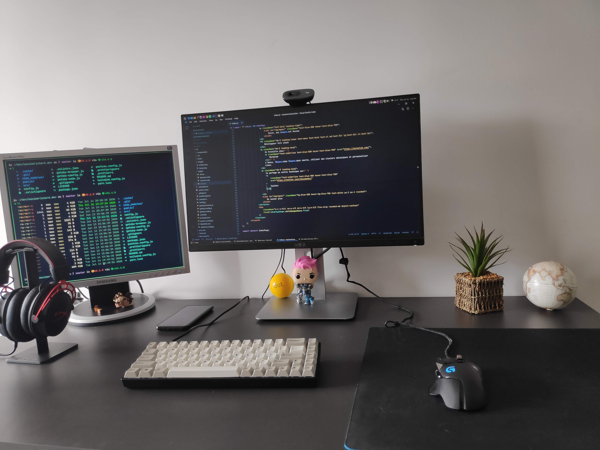

# Mon Setup

Voici un aperçu de certains des logiciels et matériels que j'utilise actuellement au quotidien pour le développement web et d'autres activités. Je change assez souvent de configuration, cette page servira donc de point de repère pour les développeurs curieux.

> TLDR: Mon [dotfiles](https://github.com/zyhou/dotfiles) avec toutes mes configurations.

En <abbr title="Operating System">OS</abbr>, j'ai [Linux Mint 20](https://linuxmint.com/download.php) en verion MATE avec le théme [Arc-Darkest](https://www.mate-look.org/p/1317409/) et les icones [Arc-Darkest](https://www.mate-look.org/p/1333421/). Étant joueur, j'utilise Windows 10 aussi bien pour jouer que pour coder, j'utilise le sous systéme Linux [WSL 2.0](https://docs.microsoft.com/en-us/windows/wsl/) dans lequel j'ai installé [Ubuntu 20.4](https://www.microsoft.com/en-us/p/ubuntu-2004-lts/9n6svws3rx71).

## Éditeur de code et Terminal

-   [Visual Studio Code](https://code.visualstudio.com/) est mon éditeur du moment. Mes settings se trouvent [ici](https://github.com/zyhou/dotfiles/blob/master/config/vscode.json).
-   Mon thème est l'excellentissime [Night Owl](https://marketplace.visualstudio.com/items?itemName=sdras.night-owl) de [Sarah Drasner](https://twitter.com/sarah_edo). Il existe pour presque [tous les éditeurs](https://github.com/sdras/night-owl-vscode-theme#dark-theme).
-   En font, j'ai [JetBrains Mono](https://www.jetbrains.com/lp/mono/) en version [Nerd Fonts](https://github.com/ryanoasis/nerd-fonts/tree/master/patched-fonts/JetBrainsMono/Medium/complete). Sur Windows, j'ai opté pour [Cascadia Code](https://github.com/microsoft/cascadia-code) en version [Nerd Fonts](https://github.com/ryanoasis/nerd-fonts/tree/master/patched-fonts/CascadiaCode/complete).
-   J'utilise [Hyper](https://hyper.is/) pour mon terminal sur Linux ([config](https://github.com/zyhou/dotfiles/blob/master/config/.hyper.js)) et [Terminal](https://github.com/microsoft/terminal) sur Windows ([config](https://github.com/zyhou/dotfiles/blob/master/config/settings.json)).
-   Plusieurs images sont disponibles [ici](https://github.com/zyhou/dotfiles).

## CLI

La configuration complète de tous ces outils est présente dans mon fichier `.zshrc`, que vous pouvez trouver [ici](https://github.com/zyhou/dotfiles/blob/master/config/.zshrc).

-   [oh my zsh > bash](https://ohmyz.sh/) qui apporte une liste de plugins intéressants.
-   [bat > cat](https://github.com/sharkdp/bat) avec night-owlish comme thème.
-   [exa](https://github.com/ogham/exa) pour améliorer l'affichage de `ls`.
-   [fd > find](https://github.com/sharkdp/fd) qui a des arguments plus simples à retenir que `find`.
-   Tous les matins, je lance [git-standup](https://github.com/kamranahmedse/git-standup) qui me rappelle les commits de la veille.
-   [fzf > ctrl+r](https://github.com/junegunn/fzf) pour trouver d'anciennes lignes de commandes.

## Applications

Vous pouvez trouver toutes les applications que j'installe lorsque je configure un nouveau ordinateur sous Linux grâce à mon [dotfiles](https://github.com/zyhou/dotfiles/blob/master/package.list). Voici quelques applications (sans ordre particulier):

-   Je suis un grand fan d'[Albert](https://albertlauncher.github.io/).
-   J'utilise [Boostnote](https://github.com/BoostIO/Boostnote) pour ma prise de notes.
-   [Flameshot](https://flameshot.js.org/#/) qui permet de faire des screenshots facilement.
-   Et [Peek](https://github.com/phw/peek) pour créer des GIF.
-   [Responsively App](https://responsively.app/) pour développer plus rapidement sur une application responsive.

## Extensions Chrome

-   J'utilise [JSON Formatter](https://chrome.google.com/webstore/detail/json-formatter/bcjindcccaagfpapjjmafapmmgkkhgoa) pour avoir un meilleur rendu du JSON.
-   Même si personne désactive Javascript, [Quick Javascript Switcher](https://chrome.google.com/webstore/detail/quick-javascript-switcher/geddoclleiomckbhadiaipdggiiccfje) me permet de tester le <abbr title="Server Side Rendering">SSR</abbr> facilement.
-   [React Developer Tools](https://chrome.google.com/webstore/detail/react-developer-tools/fmkadmapgofadopljbjfkapdkoienihi) est indispensable pour un développeur React.
-   Comme pour React mais pour Redux, je vous présente [Redux DevTools](https://chrome.google.com/webstore/detail/redux-devtools/lmhkpmbekcpmknklioeibfkpmmfibljd).
-   Je me sers souvent de Trello pour gèrer des projets, deux extensions afin gagner du temps, [Trello Card Numbers](https://chrome.google.com/webstore/detail/trello-card-numbers/kadpkdielickimifpinkknemjdipghaf) et [Points for Trello - Combined Edition](https://chrome.google.com/webstore/detail/points-for-trello-combine/elfbcdococbdgeaolelhgdghjgkkhndf).
-   Pour la gestion de mes mots de passe, je fais confiance à [LastPass: Free Password Manager](https://chrome.google.com/webstore/detail/lastpass-free-password-ma/hdokiejnpimakedhajhdlcegeplioahd).
-   Pour recevoir les notifications de nouveaux mails sans avoir à laisser Gmail ouvert, j'utilise [Checker Plus for Gmail™](https://chrome.google.com/webstore/detail/checker-plus-for-gmail/oeopbcgkkoapgobdbedcemjljbihmemj).
-   Malheureusement, j'ai un bloqueur de pub avec [uBlock Origin](https://chrome.google.com/webstore/detail/ublock-origin/cjpalhdlnbpafiamejdnhcphjbkeiagm), je n'hésite pas à mettre mes sites favoris dans la liste des autorisations.
-   J'adore regarder des compétitions sur Twitch, [BetterTTV](https://chrome.google.com/webstore/detail/betterttv/ajopnjidmegmdimjlfnijceegpefgped) est devenu essentiel.
-   [Hover Zoom+](https://chrome.google.com/webstore/detail/hover-zoom%20/pccckmaobkjjboncdfnnofkonhgpceea) permet de faire un zoom sur les images d'un site.

## Équipements

-   Mon écran principal est un 24" 1080p [Dell U2414H](https://www.amazon.fr/gp/product/B00H3JIGHA).
-   À ma gauche, j'ai un vieux Samsung 19" et à ma droite un pc portable [ASUSPRO B8430UA](https://www.asus.com/fr/Commercial-Laptops/ASUSPRO-B8430UA/) qui vient de mon entreprise.
-   Je suis assis sur une [Secretlab OMEGA](https://secretlab.eu/fr/collections/omega-series#omega_2020-stealth).
-   Mon bureau est un Ikea simple noir (actuellement indisponible).
-   J'ai monté ma tour en 2015, elle possède un INTEL Core i5 6600, une GeFORCE GTX 970 et une RAM HyperX Fury 8Go.
-   Mon clavier mécanique est le [TADA68](https://kbdfans.com/collections/fully-assembled-keyboard/products/fully-assembled-low-profile-case-tada68-keyboard) 65% avec des Gateron Brown en switch.
-   Une souris [Logitech G502](https://www.amazon.fr/gp/product/B07GS6ZB7T) et un tapis [Logitech G240](https://www.amazon.fr/gp/product/B01DIJIDKI),
-   Mon casque... dois-je vraiment le présenter ? Le [HyperX Cloud Alpha](https://www.amazon.fr/gp/product/B076GT6XJ9).
-   Mon support de casque est un [New Bee](https://www.amazon.fr/gp/product/B072BV6X1Q).
-   Une simple [Logitech C270](https://www.amazon.fr/gp/product/B01BGBJ8Y0) pour la Webcam.
-   Une lampe [tertial](https://www.ikea.com/fr/fr/p/tertial-lampe-de-bureau-gris-fonce-50355395/) que j'accroche au bureau.
-   Un téléphone portable [Xiaomi Pocophone F1](https://www.google.com/search?q=Xiaomi+Pocophone+F1) avec une batterie externe [Anker PowerCore](https://www.amazon.fr/gp/product/B01JIYWUBA) pour les voyages.
-   En déplacement, j'opte pour le sac à dos [Case Logic DLBP114K](https://www.amazon.fr/gp/product/B004AM624C) pour ranger mon matériel.
-   Il est important de s'hydrater, [ma courde de un litre](https://www.decathlon.fr/p/gourde-randonnee-500-bouchon-ouverture-rapide-1-litre-aluminium-bleu/_/R-p-109606) n'est jamais loin de moi.
-   Un figurine Funko Overwatch [Zarya](https://www.amazon.fr/gp/product/B0797L9FK7).

> Tous les produits présentés sont des produits que j'ai achetés. Il ne s'agit pas de partenariats ni de liens d'affiliations.
